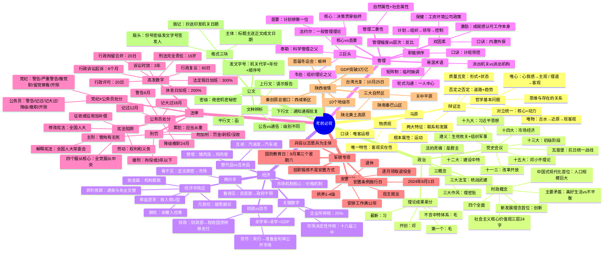
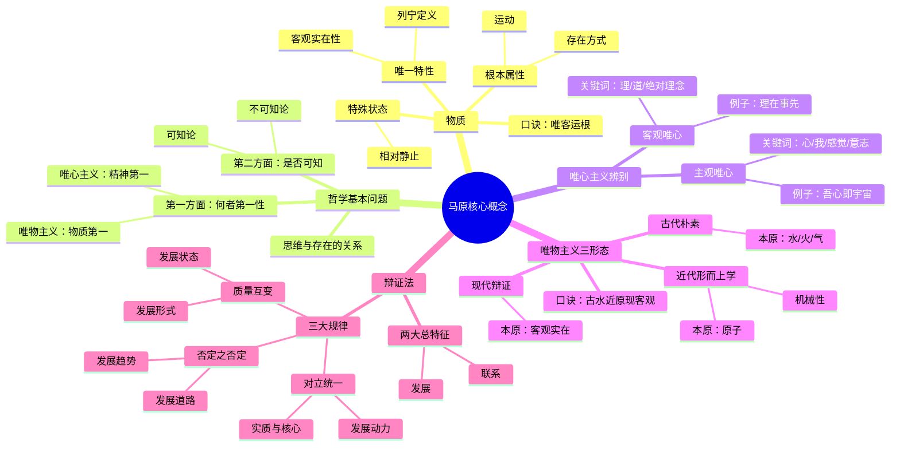
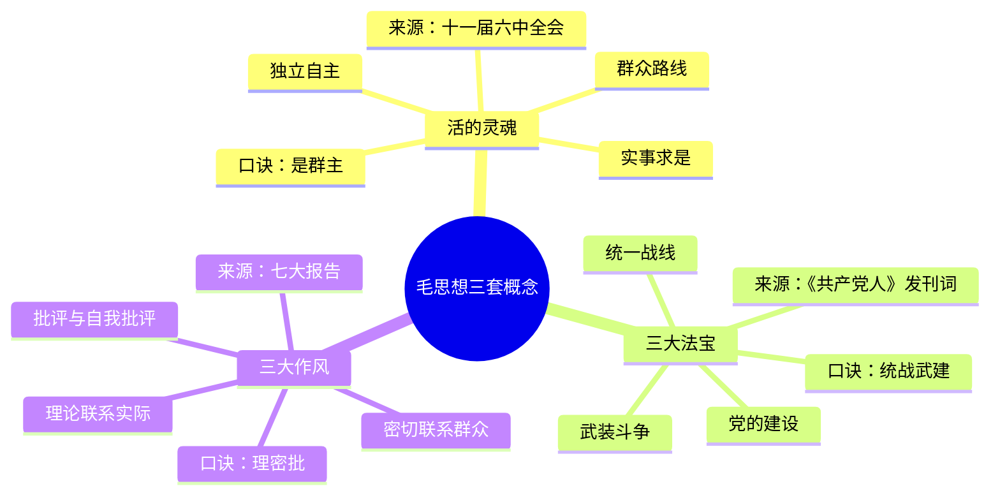
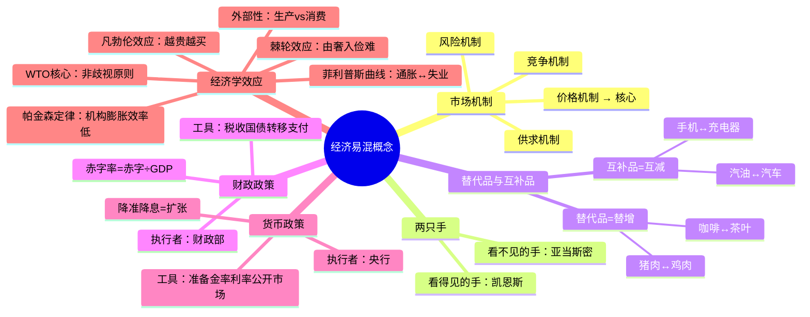
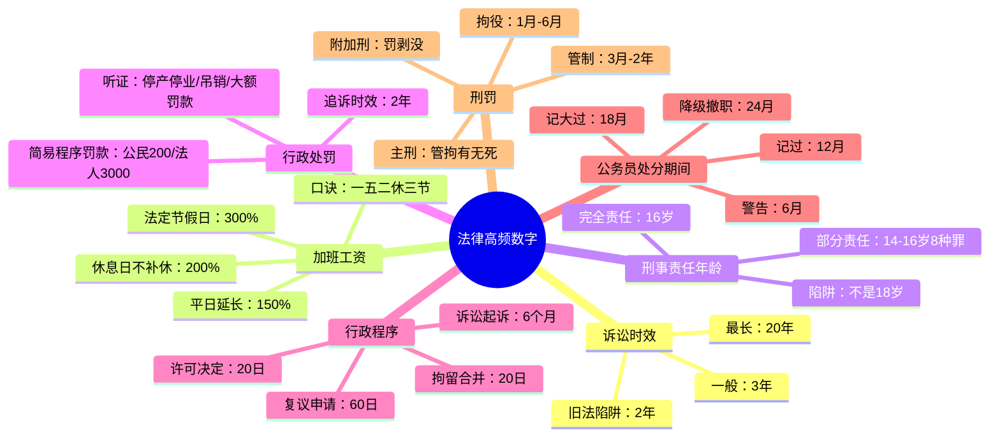
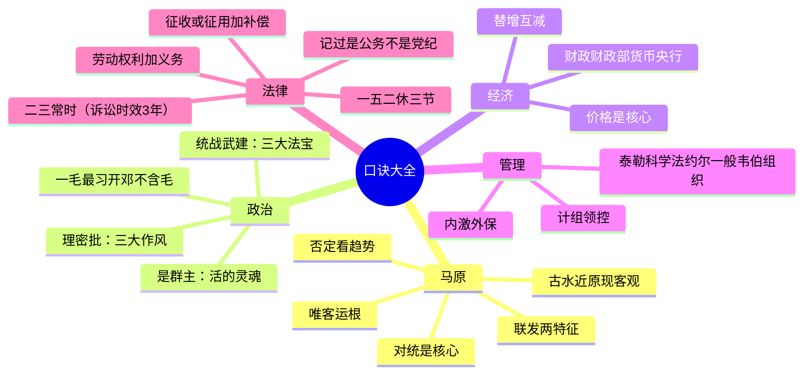

# 🧠 考前必背 — 思维导图

> 在 Obsidian 阅读模式下（Ctrl/Cmd+E）查看，自动渲染为可视化思维导图。

---

## 总览导图

---

## 马原概念辨析

---

## 政治三概念串线

---

## 经济易混效应全景

---

## 法律数字陷阱

---

## 终极速记口诀图

---

> 💡 **使用方式**：在 Obsidian 中按 `Ctrl+E`（或 `Cmd+E`）切换到阅读模式，以上 Mermaid 代码块会自动渲染为可视化思维导图。可以放大缩小、拖拽查看。
